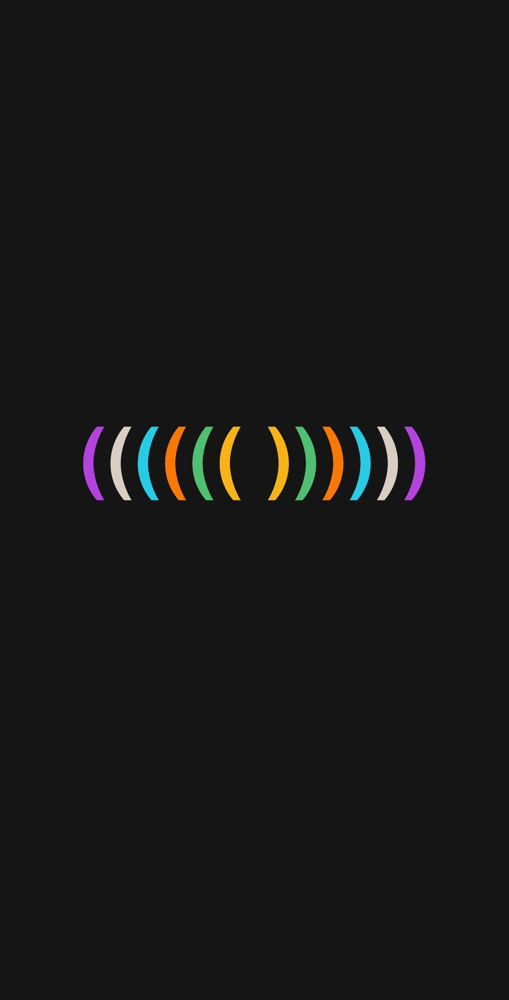
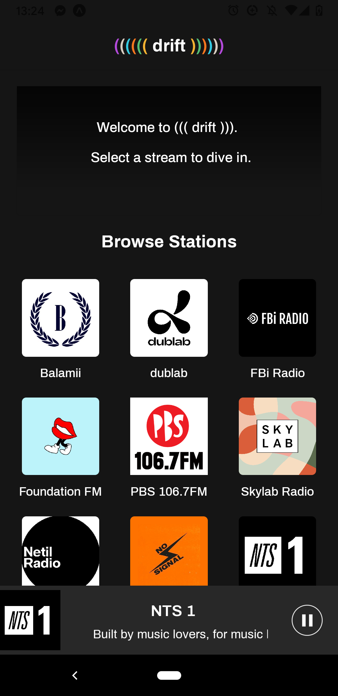

# ((( drift )))

 

## About

((( drift ))) is a mobile app for listening to online radio, from a small, curated selection of stations. It was built with Expo/React Native, as my first foray into those tools.

## Installation

If you have the Expo client app installed on your phone, you can test out the current published/deployed version of drift at expo.io/@mackavelli/drift

## Build Details

Some of the tools, libraries, and frameworks utilised by ((( drift ))):

- Expo (https://expo.io)
- Expo Audio API for loading and playback of audio streams
- React Navigation for ...navigation (https://reactnavigation.org/)
- React Native Paper Material Design library (https://reactnativepaper.com/)
- React Native Auto-Scrolling (https://github.com/minhtc/react-native-auto-scrolling)

## Known bugs

Initial build only allows full basic functionality with Android, hopefully with iOS coming soon.

- 3-12-2020: If a station is selected while a previously selected station is still loading (and player is already in 'playing' state), creates two stream instances, with only most recent able to be controlled with play/pause button

## Contributing

Pull requests are welcome. For major changes, please open an issue first to discuss what you would like to change.

## License

This project is licensed under the [MIT](https://choosealicense.com/licenses/mit/) license.
